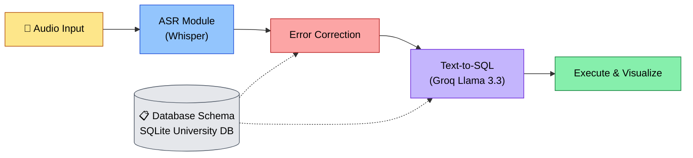

# 🎙️ Voice2Query — AI-Powered Speech-to-SQL

**Interactive Database Exploration through Voice Commands**

A cascaded pipeline that turns spoken questions into database answers: **Speech → Text → SQL → Results → Visualization**.


---

## Table of Contents

1. [Overview](#overview)
2. [Architecture](#architecture)
3. [Project Structure](#project-structure)
4. [Getting Started](#getting-started)
5. [Database Schema](#database-schema)
6. [Module Details](#module-details)
7. [Testing](#testing)
8. [Team](#team)
9. [License](#license)

---

## Overview

Voice2Query lets you query a relational database using plain spoken language — no SQL knowledge required. A user speaks (or types) a question, and the system transcribes, corrects, translates, executes, and visualizes the result end-to-end.

**Key features**
- 🎤 Three input modes: voice recording, audio file upload, or text
- 🧠 Local Whisper transcription — no API key required for ASR
- 🔧 Schema-aware NL → SQL generation via Groq's Llama 3.3 70B
- 🛡️ SELECT-only safety validation before execution
- 🔍 Domain-aware fuzzy error correction for ASR mistakes
- 📊 Auto-generated Plotly charts and query history in the dashboard

---

## Architecture



The pipeline is cascaded: each stage's output feeds the next, with the database schema injected into both the error-correction and text-to-SQL stages for context. GitHub renders this diagram automatically on the repo page.

---

## Project Structure

```
voice2query/
├── config.py                # Central configuration
├── requirements.txt         # Dependencies
├── .env.example              # API key template
├── README.md
│
├── database/
│   ├── schema.sql            # DDL: 6 tables
│   ├── seed_data.sql         # 250+ rows of mock data
│   ├── setup_db.py           # Initialize the database
│   └── connection.py         # SQLAlchemy + schema introspection
│
├── modules/
│   ├── asr/
│   │   └── transcriber.py    # Whisper speech-to-text
│   ├── text_to_sql/
│   │   ├── schema_prompt.py  # Schema-aware prompt builder
│   │   └── generator.py      # LLM-based NL → SQL
│   ├── error_correction/
│   │   └── corrector.py      # DB-aware fuzzy correction
│   └── executor/
│       └── query_runner.py   # Safe SQL execution
│
├── dashboard/
│   └── app.py                # Streamlit UI
│
├── audio_samples/             # Sample audio files
│
└── tests/                     # Pytest test suite
    ├── test_db.py
    ├── test_asr.py
    ├── test_text_to_sql.py
    ├── test_executor.py
    └── test_correction.py
```

---

## Getting Started

### 1. Clone & install dependencies

```bash
cd voice2query
pip install -r requirements.txt
```

### 2. Configure your API key

```bash
cp .env.example .env
# Edit .env and add your Groq API key
```

### 3. Initialize the database

```bash
python database/setup_db.py
```

### 4. Launch the dashboard

```bash
streamlit run dashboard/app.py
```

---

## Database Schema

**University Database** — 6 tables, 250+ rows:

| Table | Rows | Description |
|---|---|---|
| `departments` | 8 | Academic departments |
| `professors` | 20 | Faculty members |
| `students` | 50 | Enrolled students |
| `courses` | 30 | Course catalog |
| `enrollments` | 150 | Student–course enrollments |
| `scholarships` | 20 | Financial awards |

**Supported query patterns:** JOINs, aggregations, subqueries, GROUP BY + HAVING, multi-table joins.

---

## Module Details

| Module | Description |
|---|---|
| **ASR** (`modules/asr/`) | Local OpenAI Whisper (`base` model). Supports `.wav`, `.mp3`, `.m4a`, `.webm`, `.flac`. Includes confidence scoring and silence detection. No API key needed — runs entirely on CPU. |
| **Text-to-SQL** (`modules/text_to_sql/`) | Groq Llama 3.3 70B (free tier, OpenAI-compatible API) with schema-aware prompting: dynamic DDL injection, few-shot examples, SELECT-only safety validation, and markdown-fence cleanup. |
| **Error Correction** (`modules/error_correction/`) | Domain dictionary for common ASR mistakes, fuzzy matching against DB terms (table/column names), and multi-word value matching (e.g., department names). |
| **Dashboard** (`dashboard/`) | Streamlit UI with three input modes, step-by-step pipeline visualization, auto-chart generation via Plotly, and query history tracking. |

---

## Testing

```bash
python -m pytest tests/ -v
```

Covers the database layer, ASR, text-to-SQL generation, execution, and error correction.

---

## Team

| Member | Responsibility |
|---|---|
| Deepak Kushwaha | Database Schema & Setup |
| Vedant Gajanan Pawar | ASR Module (Whisper) |
| Subhadip Maity | Text-to-SQL (LLM) |
| Vishal Kumar | Dashboard & Error Correction |
---

## License

This project is licensed under the MIT License. See the [LICENSE](LICENSE) file for details.
